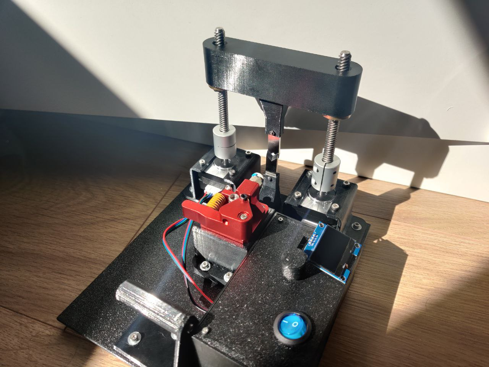

# Automatic Wire Stripper and Cutter

A 3D printed automatic wire stripper and cutter. You simply choose your measurements on a screen, press a button, and it does it all for you. It will strip the wire and cut the wire depending on the options you chose.

There is a [video](https://youtu.be/pbuzLy1ktKM) associated with this repository/project, I highly recommend watching it before using this repo.

Check the original repo for extra details.

# Changes provided by this fork

The origingal project is awesome but I need more accuracy and control because my cables are thinner (like 1.1mm diameter) and weaker. I have a lot of experience with `Trinamic` drivers and I thought that I can make the machine
fit to my case using TMC2209 instead of generic ones.

The benefits I got when changing from generic drives to TMC2209 are:
 * Far more accuracy. With the microstepping feature I can achieve near absolute precission.
 * Autocalibration: The TMC2209 has stallGuard so you can detect when the motor is doing more force so we
 can detect when the blade reached the cable so we dont have to manually masure an calibrate. It is also 
 allows us to detect when the cut is done.
 * Silence: With StealthChop the motors are inaudible and the accuracy is still great. Anyway this is optional.
 * Control: Using UART protocol you can control the max current and much more parameters easily.
 * The motor movement is very smooth

I also changed the library `Stepper` by `AccelStepper`. The reason is that AccelStepper does not block so is easier
to control at every step if everything is going fine. It also handles accelerations easily so the cuts are less
aggresive with the cable.

The project is migrated from `Arduino IDE` to `platformio`. The platformio project
 is the `AutoWireCutterStripper`folder

I also changed the encoder library to support generic EC11 encoders. I was not able to make it works with the original
library. Also, the encoder change detection is done using interrupts instead of polling so we have more cpu cycles
 (the esp32 can use any gpio as interrupt so there is no reason for not using it) and smoother detection.

The code was mostly refactorized to make it easier to extend and more organized. The code is now splitted into
two main parts:
 * Guillotine: A class to control the machine intself. The blades, movement, retraction... An easy to use driver class.
 * UI: All related to the UI. The buttons, display and encoder.

The idea was to decouple the functionality from the UI. So now you could be able to control the blades using other
user interfaces like a web hosted in the `ESP32`. Or using other kind of screens or buttons.

The last thing I did is a printable base to attach all the parts (base.stl and the openscad base.scad). It costs like 100g of material but for me it worth it.

# PCB Board

The design is not very complex but you have to solder so many cables. I made
my first hand made board and once everything was fine I designed a board using
`Kicad`. The gerbers are ready to be used with any PCB manufacturer at [kicad-wire-cutter/gerbers.zip](kicad-wire-cutter/gerbers.zip) but I also
provide the kicad files so you can edit it and adapt it to your own needs.

This is the real PCB

And the PCB with the elements soldered

It provides an extra power connector in case you prefer to use this
kind.

My old board just for reference. It took a lot of time and care to build it.
We all remember it forever but it is not needed anymore. Thank you for
 your service little board.

This is how it looks in the case

# State Machine

The cutting process is managed by a state machine. I think that it makes the
process easier to understand, easier to modify and robust. This is the diagram
of the state machine

It is very simple and apart form the variable `totalStrips` is just need
to know the previous state.

# Images of the machine I built

